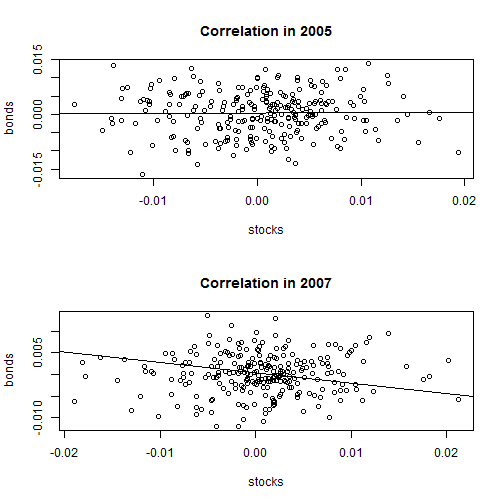

## The Problem

1. Investors need to diversify their portfolio
2. Diversification is largely a function of how correlated holdings are
3. How can investors see if their holdings are correlated?

Two very popular investment options are the S&P 500 ETF (ticker: SPY) and the Long US Treasury ETF (ticker: TLT).
Do these holding offer diversification? Let's look at how correlated their returns are.

```r
dat = read.csv('market dat.csv')
```

---  

## The Solution?

 


---

## The Problem Goes Deeper...

Looks like the correlation changes over time. There's a very flat slope in 2005, but a negative slope in 2007. That means investors' risk exposure changes over time!  
It's not enough to know two assets are inversely correlated over the long run. You need to know how those correlations change year to year.
How can investors easily access historical data on the correlation between assets?

---
## The Solution!

Our app allows investors to see stock & bond correlation year-by-year.  
This gives investors a fuller understanding of the risks they face.  
Don't believe us? Try it yourself!
<https://kevin-bishop.shinyapps.io/MarketCorrelation/>


